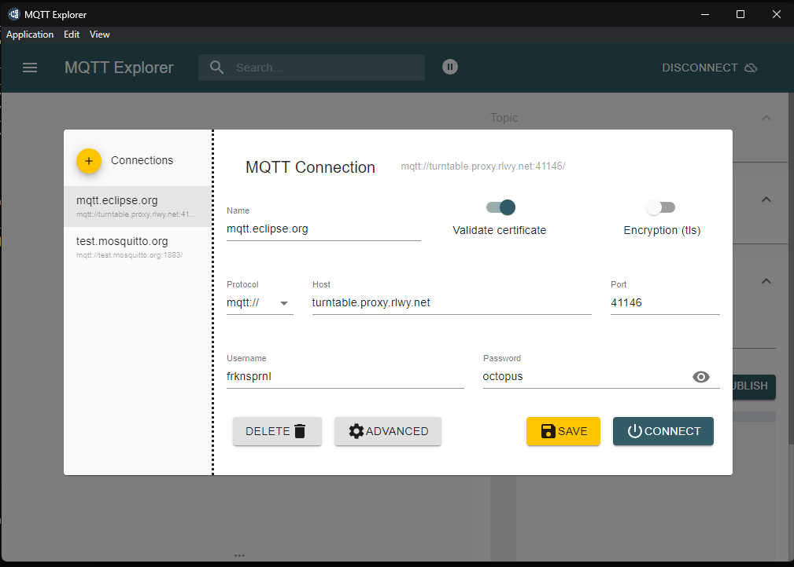
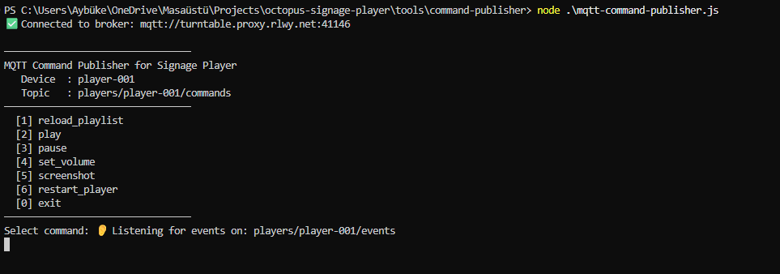
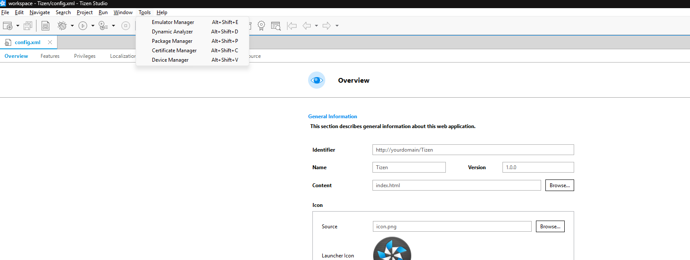
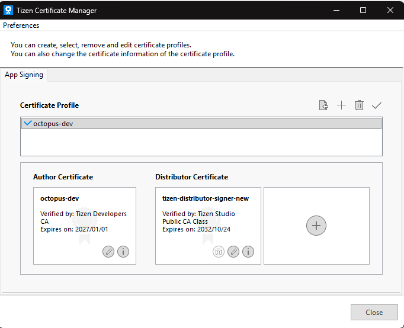
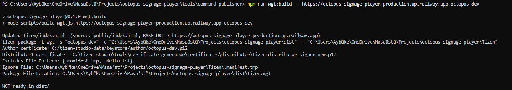
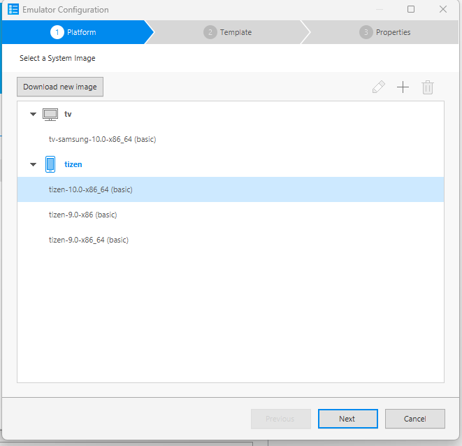
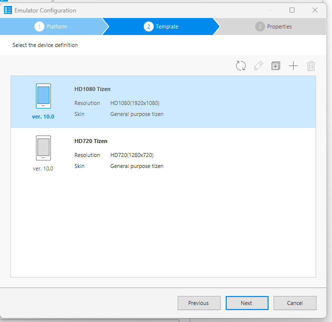
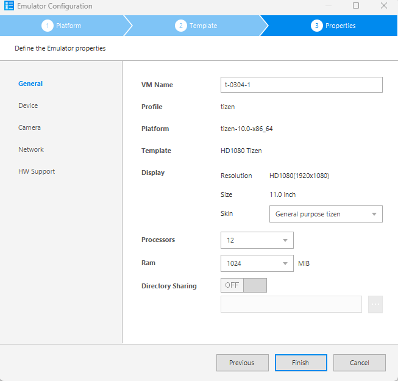
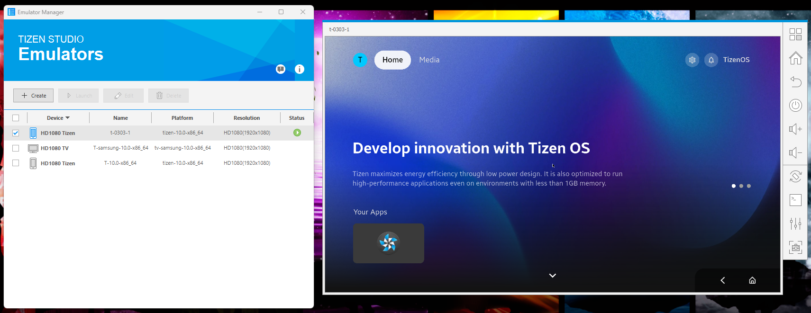
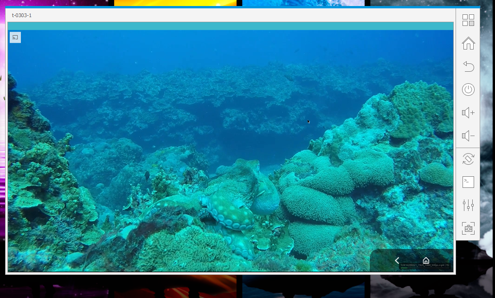

# Octopus Signage Player

Production-grade digital signage player — Tizen / Browser platformlarında çalışmak üzere tasarlanmış, offline-first, MQTT üzerinden uzaktan komut alabilen Node.js + Express mimarisi.

---

## İçindekiler

- [Mimari Genel Bakış](#mimari-genel-bakış)
- [Hızlı Başlangıç (Lokal)](#hızlı-başlangıç-lokal)
- [Environment Değişkenleri](#environment-değişkenleri)
- [Docker Compose — Lokal Geliştirme](#docker-compose--lokal-geliştirme)
- [Klasör Yapısı](#klasör-yapısı)
- [Mimari Detay](#mimari-detay)
- [MQTT](#mqtt)
- [Command Publisher — Test Aracı](#command-publisher--test-aracı)
- [Tizen Build ve Emülatör](#tizen-build-ve-emülatör)
- [Cloud Deploy (Railway)](#cloud-deploy-railway)
- [Offline-First](#offline-first)
- [Error Handling ve Resilience](#error-handling-ve-resilience)
- [Testler](#testler)
- [Trade-off ve Tasarım Kararları](#trade-off-ve-tasarım-kararları)

---

## Mimari Genel Bakış

```
Tizen / Browser Client (index.html)
         │  HTTP + SSE
         ▼
  Express Server (Node.js)
    ├── GET  /                    → Player UI (public/index.html)
    ├── GET  /api/playlist        → PlaylistService'in bellekteki listesi
    ├── GET  /api/content-source  → Yerleşik demo playlist (CMS yoksa fallback)
    ├── GET  /api/health          → MQTT durumu, playlist sayısı, son hata
    ├── GET  /events              → SSE stream — MQTT komutlarını browser'a iletir
    └── POST /api/ack             → Browser'dan gelen komut sonuçlarını MQTT'e yayar
         │
  PlaylistService ──────── PLAYLIST_ENDPOINT'e HTTP fetch + retry + localStorage cache
         │
  CommandHandler ────────── IEventPublisher / IPlaylistRepository / ICommandBus
         │
  MqttConnection ────────── Broker bağlantısı, reconnect/backoff, subscribe/publish
         │
  MQTT Broker (mosquitto / harici)
         │
  Command Publisher CLI ─── Geliştirici / test aracı; tüm komutları interaktif gönderir
```

---

## Hızlı Başlangıç (Lokal)

### Gereksinimler

- Node.js >= 20
- Docker + Docker Compose

### Çalıştırma

```bash
git clone <repo-url>
cd octopus-signage-player

cp .env.example .env   # gerekli env değerlerini doldurun

docker compose up
```

Tarayıcıda `http://localhost:8080` adresini aç — player çalışıyor olacak.

> `PLAYLIST_ENDPOINT` set edilmezse player kendi `/api/content-source` endpoint'inden demo içerik alır; harici CMS entegrasyonuna gerek yoktur.

---

## Environment Değişkenleri

`.env` dosyasını oluşturun:

```env
NODE_ENV=development
DEVICE_ID=player-001
MQTT_BROKER_URL=mqtt://localhost:1883
MQTT_USERNAME=                        # broker kimlik doğrulaması için (opsiyonel)
MQTT_PASSWORD=                        # broker kimlik doğrulaması için (opsiyonel)
PLAYLIST_ENDPOINT=                    # boş → http://localhost:{WEB_PORT}/api/content-source
WEB_PORT=8080
LOG_LEVEL=info
PLATFORM=browser                      # browser | tizen
```

### Production (Railway)

```env
NODE_ENV=production
DEVICE_ID=player-001
MQTT_BROKER_URL=mqtt://turntable.proxy.rlwy.net:41146
MQTT_USERNAME=frknsprnl
MQTT_PASSWORD=octopus
WEB_PORT=8080
PLATFORM=browser
LOG_LEVEL=info
```

---

## Docker Compose — Lokal Geliştirme

Docker Compose, MQTT broker + player backend'ini tek komutla ayağa kaldırarak lokal geliştirme ortamını sıfır konfigürasyonla çalıştırılabilir hale getirir.

### Servisler

| Servis | İmaj | Port | Açıklama |
|---|---|---|---|
| `mosquitto` | `eclipse-mosquitto:2` | 1883, 9001 | MQTT broker — her zaman başlar |
| `player` | `Dockerfile` (bu repo) | 8080 | Node.js backend — her zaman başlar |
| `mock-server` | `node:20-alpine` | 3000 | Harici playlist sunucusu — sadece `dev` profiliyle |

### Standart çalıştırma

```bash
docker compose up             # ön planda çalıştırın
docker compose up -d          # arka planda çalıştırın
docker compose up -d --build  # image'ı yeniden build edip başlatın
```

### Opsiyonel mock-server ile (dev profili)

`mock-server`, `docker-compose.yml` içinde `profiles: [dev]` ile işaretlenmiştir. Oynatma listesini dışarıdan sunmak isterseniz:

```bash
docker compose --profile dev up
```

Ardından `.env` dosyasında şunu ayarlayın:

```env
PLAYLIST_ENDPOINT=http://localhost:3000/playlist
```

### Logları takip edin

```bash
docker compose logs -f player
docker compose logs -f mosquitto
```

---

## Klasör Yapısı

```
src/
  domain/                 → Playlist ve komut domain tipleri (PlaylistItem, Command, CommandName…)
  core/                   → IConfigProvider, ICommandBus, IPlaylistRepository, IEventPublisher
  config/                 → EnvConfigAdapter (IConfigProvider implementasyonu)
  services/               → PlaylistService (fetch + retry + localStorage cache)
  handlers/               → CommandHandler (MQTT komut yönetimi, idempotency)
  infrastructure/
    mqtt/                 → MqttConnection (bağlantı, exponential backoff, QoS 1)
    logger/               → Logger singleton (info / warn / error seviyeleri)
  platform/               → IPlatformAdapter, BrowserPlatformAdapter, TizenPlatformAdapter
  web/                    → Express server (REST + SSE), CommandStream

public/
  index.html              → Tarayıcı tabanlı player UI — geliştirme ve browser testi için

Tizen/                    → Tizen Studio projesi (.project, config.xml, icon.png)
  config.xml              → Tizen Web App manifesti (internet privilege + access origin)
  index.html              → Build sırasında public/index.html'den üretilir (BASE_URL enjekte edilir)

tizen/
  config.xml              → Tizen manifest şablonu
  icon.png                → Uygulama ikonu

scripts/
  build-wgt.js            → .wgt build scripti (BASE_URL enjeksiyonu + Tizen CLI paketleme)

tools/
  mock-server/            → Harici playlist sunucusu (docker compose --profile dev)
  command-publisher/      → Interaktif MQTT komut gönderici (test aracı)

docker/
  mosquitto/
    mosquitto.conf        → Broker konfigürasyonu

dist/                     → Build çıktıları (.wgt)
```

---

## Mimari Detay

### Katman Ayrımı ve SOLID

| Katman | Sorumluluk |
|---|---|
| `domain/` | Saf domain tipleri (playlist, komut, event) — hiçbir infra import etmez |
| `core/ports.ts` | Tüm interface tanımları (port'lar) — bağımlılık yönü her zaman içeri |
| `config/` | Env okuma — `IConfigProvider` üzerinden; test edilebilir, değiştirilebilir |
| `services/` | PlaylistService — sadece fetch, retry, cache; platform bağımlılığı yok |
| `handlers/` | CommandHandler — sadece iş mantığı; concrete sınıf bilmez, interface'e bağımlı |
| `infrastructure/mqtt/` | Ağ katmanı — bağlantı, reconnect, pub/sub; handler bu katmana dokunmaz |
| `platform/` | Tizen/Browser API izolasyonu — adapter pattern ile değiştirilebilir |
| `web/` | Express + SSE — dış dünya ile iletişim kapısı |

- **SRP**: Her sınıfın tek sorumluluğu var
- **OCP**: Yeni medya tipi için `renderers` map'e bir satır yeterli
- **DIP**: `CommandHandler`, `IEventPublisher` / `IPlaylistRepository` / `ICommandBus` interface'lerine bağımlı; hiçbir concrete sınıfı import etmez

### Design Patterns

| Pattern | Nerede |
|---|---|
| Factory | `MqttConnectionFactory`, `PlatformAdapterFactory` |
| Strategy | `renderers` map — `image` / `video` renderer (`public/index.html`) |
| Observer / Event-driven | `MqttConnection`, `PlaylistService` (EventEmitter); `CommandStream` (SSE pub/sub) |
| Singleton | `Logger` |

---

## MQTT

### Topic Yapısı

| Yön | Topic |
|---|---|
| Subscribe (komut al) | `players/{deviceId}/commands` |
| Publish (ack / event) | `players/{deviceId}/events` |

### Bağlantı Bilgileri (Production)

| Parametre | Değer |
|---|---|
| Broker URL | `mqtt://turntable.proxy.rlwy.net:41146` |
| Username | `frknsprnl` |
| Password | `octopus` |
| Default Device ID | `player-001` |
| Commands topic | `players/player-001/commands` |
| Events topic | `players/player-001/events` |

Production broker'ı [MQTT Explorer](https://github.com/thomasnordquist/MQTT-Explorer) veya benzeri bir istemciyle görüntülemek için yukarıdaki bağlantı bilgilerini kullanabilirsiniz.

| Açıklama | Ekran görüntüsü |
|----------|-----------------|
| MQTT Explorer ile production broker'a bağlanıp topic'leri ve mesajları görüntüleme |  |

### QoS Tercihi

Hem subscribe hem publish **QoS 1** kullanır.

- **QoS 0** — "at most once"; komutun kaybolması kabul edilemez
- **QoS 1** — "at least once"; aynı komut tekrar gelebilir → `correlationId` ile idempotency sağlanır
- **QoS 2** — "exactly once"; overhead fazla, signage senaryosunda `correlationId` zaten duplicate koruması sağladığı için gereksiz

### Reconnect Stratejisi

`MqttConnection`, bağlantı koptuğunda **exponential backoff** ile yeniden bağlanır:
- Başlangıç bekleme: 5 sn
- Her denemede 2 katına çıkar
- Maksimum bekleme: 60 sn

### Desteklenen Komutlar

| Komut | Açıklama |
|---|---|
| `reload_playlist` | Playlist endpoint'inden yeniden çek, cache'i güncelle, ack döner |
| `restart_player` | Soft-restart — playlist ve state sıfırla, crash etmeden; ack döner |
| `play` | Duraklatılmış medyayı devam ettir |
| `pause` | Mevcut medyayı durdur |
| `set_volume` | Ses seviyesini ayarla (0–100); ack ile `volumePct` döner |
| `screenshot` | Canvas ile ekran görüntüsü al, base64 PNG olarak ack ile döner |

### Örnek Payload'lar

**Komut:**
```json
{
  "command": "reload_playlist",
  "correlationId": "corr-001",
  "timestamp": 1700000000
}
```

**Başarılı ack:**
```json
{
  "type": "command_result",
  "command": "reload_playlist",
  "correlationId": "corr-001",
  "status": "success",
  "payload": { "itemCount": 4 }
}
```

**Hata ack:**
```json
{
  "type": "command_result",
  "command": "reload_playlist",
  "correlationId": "corr-001",
  "status": "error",
  "error": {
    "code": "RELOAD_FAILED",
    "message": "Playlist endpoint unreachable or returned invalid response"
  }
}
```

**Screenshot ack:**
```json
{
  "type": "command_result",
  "command": "screenshot",
  "correlationId": "corr-002",
  "status": "success",
  "payload": {
    "format": "image/png",
    "base64": "<BASE64_IMAGE_DATA>"
  }
}
```

---

## Command Publisher — Test Aracı

`tools/command-publisher/`, production MQTT broker'ına bağlanıp tüm komutları interaktif menü üzerinden göndermeyi sağlayan geliştirici aracıdır. Player'dan dönen event (ack) mesajlarını da aynı terminalde dinler.

Broker bağlantı bilgileri ve device ID, dosyanın başında sabit olarak tanımlıdır:

```js
const DEVICE_ID   = 'player-001';
const BROKER_URL  = 'mqtt://turntable.proxy.rlwy.net:41146';
const BROKER_USERNAME = 'frknsprnl';
const BROKER_PASSWORD = 'octopus';
```

### Kullanım

```bash
cd tools/command-publisher
npm install
node mqtt-command-publisher.js
```

Bağlantı kurulunca interaktif menü açılır:

```
─────────────────────────────────
MQTT Command Publisher for Signage Player
   Device  : player-001
   Topic   : players/player-001/commands
─────────────────────────────────
  [1] reload_playlist
  [2] play
  [3] pause
  [4] set_volume
  [5] screenshot
  [6] restart_player
  [0] exit
─────────────────────────────────
Select command:
```

Komut gönderildiğinde player'dan dönen ack, aynı terminalde görüntülenir. Komutları gönderip sonuçlarını aynı ekranda almak için bu aracı kullanmak pratik olacaktır.

```
📨 Event received from player:
{
  "type": "command_result",
  "command": "reload_playlist",
  "correlationId": "corr-001",
  "status": "success",
  "payload": { "itemCount": 4 }
}
```

| Açıklama | Ekran görüntüsü |
|----------|-----------------|
| Command Publisher — broker bağlantısı ve komut menüsü; komutları gönderip sonuçları dinlemek için |  |

---

## Tizen Build ve Emülatör

### Gereksinimler

- [Tizen Studio](https://developer.samsung.com/tizen/overview.html) kurulu olmalı
- Tizen Studio → **Package Manager → Extension SDK → TV Extensions** yüklü olmalı
- Tizen Studio → **Certificate Manager** ile bir author profile oluşturmuş olmalısınız (ör. `octopus-dev`)

### .wgt Build Alma (tek komut)

`public/index.html` kaynak olarak kullanılır; `BASE_URL` enjekte edilerek `Tizen/index.html` dosyasına yazılır ve Tizen CLI ile imzalı `.wgt` üretilir.

```bash
npm run wgt:build -- <backend-url> <certificate-profile>
```

**Production (Railway):**
```bash
npm run wgt:build -- https://octopus-signage-player-production.up.railway.app octopus-dev
```

**Lokal LAN:**
```bash
npm run wgt:build -- http://192.168.1.100:8080 octopus-dev
```

Çıktı: `dist/Tizen.wgt`

> **Not:** Normalde `dist/` içeriği ve `.wgt` çıktısı production projelerinde `.gitignore` ile repodan hariç tutulur. Bu çalışma bir study case olduğu ve teslim edilen paketin garanti altında olmasını istediğim için `.wgt` dosyasını repoya ekledim; hazır imzalı paket `dist/Tizen.wgt` yolundan erişilebilir.

> Script ne yapar:
> 1. `public/index.html` okur
> 2. `<script>` bloğuna `var BASE_URL = '...'` enjekte eder
> 3. Relative path'leri (`/api/...`, `/events`) `BASE_URL + '/...'` ile değiştirir
> 4. `Tizen/index.html`'e yazar
> 5. `tizen package -t wgt -s <profile> -o dist -- Tizen` çalıştırır

### `Tizen/` Projesi ve `.wgt` Üretim Akışı

- `Tizen/` klasöründeki **`config.xml`**, **`icon.png`**, `js/`, `css/`, `.project`, `.tproject` ve benzeri proje dosyalarını **Tizen Studio kullanarak yarattım**:
  - Tizen Studio’da yeni bir TV Web Application projesi oluşturdum.
  - Ortaya çıkan proje klasörünü repodaki `Tizen/` klasörüne taşıdım.
- `Tizen/index.html` dosyası ise **build zamanında** güncelleniyor:
  - Kaynak HTML, repodaki `public/index.html`.
  - `scripts/build-wgt.js` script’i:
    - `public/index.html` dosyasını okur.
    - `<script>` bloğuna `BASE_URL` değerini enjekte eder.
    - `/api/...` ve `/events` isteklerini `BASE_URL + '/...'` şeklinde absolute URL’e çevirir.
    - Ortaya çıkan içeriği `Tizen/index.html` üzerine yazar.
  - Ardından aynı script Tizen CLI ile `.wgt` paketini üretir:
    - `tizen package -t wgt -s <profile> -o dist -- Tizen`

Özetle:

1. **Tizen Studio** ile `Tizen/` projesini oluşturdum (index.html hariç tüm proje dosyaları).
2. **`public/index.html`** tek kaynak olarak tutuluyor.
3. **`npm run wgt:build -- <BASE_URL> <profile>`**:
   - `public/index.html` → `Tizen/index.html` (BASE_URL enjekte edilerek)
   - `Tizen/` projesi Tizen CLI ile imzalanıp **`.wgt`** çıktısı veriyor (`dist/Tizen.wgt`).

| Adım | Ekran görüntüsü |
|------|-----------------|
| Tizen Studio Tools sekmesi |  |
| Sertifika (Certificate Manager) oluşturma |  |
| `npm run wgt:build` sonrası `dist/Tizen.wgt` çıktısı |  |

### Kullanılan Emülatör Konfigürasyonu

Bu case kapsamında aşağıdaki Tizen emülatör konfigürasyonu ile test ettim:

- **Tizen sürümü**: 10.0 (TV profile)
- **Çözünürlük**: 1920×1080
- **Oluşturma adımları**:
  - Tizen Studio → **Emulator Manager** → New TV Emulator
  - Profile olarak **Tizen 10.0** seçin
  - Çözünürlük olarak **1920×1080** seçin
  - RAM ve diğer değerleri varsayılan bırakabilirsiniz (isteğe göre artırılabilir)

| Adım | Ekran görüntüsü |
|------|-----------------|
| Emülatör oluşturma — 1 |  |
| Emülatör oluşturma — 2 |  |
| Emülatör oluşturma — 3 |  |
| Emülatörü çalıştırma + çalışır durum |  |
| Emülatörde projenin çalışır hali |  |

### Emülatörde Çalıştırma

1. Tizen Studio → **Emulator Manager** → TV emülatörünü başlatın
2. **Tools → Device Manager** → emülatörün `Connected` olduğunu doğrulayın
3. Device Manager → **Install App** → `dist/Tizen.wgt` dosyasını seçin
4. Emülatörde uygulama listesinden **Tizen** uygulamasını başlatın
5. wgt dosyası direkt olarak çalıṣan emulatorun uzerine surukle-birak yapilarak da kurulum tamamlanabilir.

### Sertifika

- **Emülatör**: author sertifikası yeterlidir; Tizen emülatör signature doğrulaması yapmaz.
- **Gerçek Samsung TV**: Tizen Studio → Certificate Manager → distributor certificate de gerekmektedir. Samsung's developer portal üzerinden cihaz DUID'i ile kayıt yapılması gerekebilir.
- Ben hem Tizen hem de Samsung TV'lerde test ettim. Çalıştığını doğruladım. Görseller ekte ve gönderdiğim mailde yer almaktadır.

### Emülatör Performansı

Tizen emülatörü QEMU tabanlı tam sistem emülasyonu yaptığından yavaştır. Hızlandırmak için:

- BIOS'ta Virtualization Technology (VT-x) özelliğini etkinleştirin
- Tizen Studio → Package Manager → **Intel HAXM** bileşenini kurun
- Emulator Manager → Edit → emülatörün RAM değerini yükseltin

> Geliştirme sırasında doğrudan tarayıcıda `http://localhost:8080` veya `https://octopus-signage-player-production.up.railway.app` üzerinden test etmek daha hızlıdır. Emülatörü yalnızca final `.wgt` doğrulaması için kullan.

---

## Cloud Deploy (Railway)

### Canlı Adresler

| Servis | URL / Adres |
|---|---|
| Player (HTTP) | `https://octopus-signage-player-production.up.railway.app` |
| MQTT Broker | `mqtt://turntable.proxy.rlwy.net:41146` |
| Health endpoint | `https://octopus-signage-player-production.up.railway.app/api/health` |
| Playlist endpoint | `https://octopus-signage-player-production.up.railway.app/api/playlist` |

Player (HTTP) adresini tarayıcıda açarak projenin UI'ını canlı ortamda görüntüleyebilir ve oynatma / playlist davranışını test edebilirsiniz. MQTT testleri de bu canlı deploy üzerinde çalışmaktadır — Command Publisher ile `players/player-001/commands` topic'ine komut gönderdiğinizde player yanıtları `players/player-001/events` üzerinden döner.

### Servis Topolojisi

```
Railway Project
  ├── player     → bu repo (Node.js / Express, port 8080)
  └── mosquitto  → eclipse-mosquitto:2 (MQTT broker, TCP 1883)
```

### Yeni Deploy Adımları

1. [Railway](https://railway.app)'de yeni proje oluştur
2. **New Service → Docker Image** → `eclipse-mosquitto:2` ekle; TCP port 1883'ü expose et
3. **New Service → GitHub Repo** → bu repo'yu bağla
4. Player servisi → **Environment Variables**:

```env
NODE_ENV=production
DEVICE_ID=player-001
MQTT_BROKER_URL=mqtt://<mosquitto-private-host>:1883
MQTT_USERNAME=<broker-username>
MQTT_PASSWORD=<broker-password>
WEB_PORT=8080
PLATFORM=browser
LOG_LEVEL=info
```

5. Player servisi → **Settings → Networking** → port 8080'i public olarak expose et
6. Verilen Railway domain ile `.wgt` build al:

```bash
npm run wgt:build -- https://<proje-adı>.up.railway.app octopus-dev
```

### Cold Start

Railway, 7/24 çalışan servisler için uyku moduna geçmez. Signage senaryosunda MQTT broker bağlantısı sürekli aktif olduğundan servis hiç uyumaz.

---

## Offline-First

### Playlist cache (localStorage)

- Playlist ilk başarılı fetch'ten sonra **`localStorage`**'a kaydedilir
- Ağ kesildiğinde `localStorage`'daki son playlist ile oynatma kesintisiz sürer
- Ağ geri geldiğinde server listesi ile cache JSON karşılaştırması yapılır; değişiklik yoksa oynatma bölünmez, değişiklik varsa sorunsuz güncellenir
- İlk açılışta cache varsa önce cache ile başlar, arka planda güncelleme kontrol eder (cold start senaryosu)

### Medya cache (IndexedDB + Blob)

Görsel ve video dosyaları **IndexedDB**'de blob olarak saklanır. Ağ kesildiğinde oynatma gerçek anlamda offline devam eder.

**Akış:**
1. Playlist yüklendikten sonra `prefetchPlaylist` arka planda her URL'i fetch edip blob'unu IndexedDB'ye yazar
2. Her medya öğesi oynatılmadan önce `resolveUrl` IndexedDB'ye bakar:
   - **Cache hit** → `URL.createObjectURL(blob)` ile yerel blob URL üretilir, ağ isteği yapılmaz
   - **Cache miss** → orijinal URL kullanılır (fallback), ağ varken yüklenir
3. `clearSlide` çağrıldığında aktif blob URL'leri `URL.revokeObjectURL` ile serbest bırakılır (24/7 çalışma için memory leak önlemi)

**Neden Service Worker değil?**  
Tizen 5+ TV platformunda Service Worker desteği kısıtlı ve güvenilmez. IndexedDB + Blob yaklaşımı Tizen ve browser ortamında eşit güvenilirlikle çalışır.

---

## Error Handling ve Resilience

| Senaryo | Davranış |
|---|---|
| Network hatası (playlist fetch) | Exponential backoff ile retry (5s → 10s → 20s … maks 60s) |
| Bozuk medya dosyası | `onerror` handler → 2 sn bekle → sonraki içeriğe geç |
| MQTT broker unreachable | Exponential backoff ile reconnect; player oynatmayı sürdürür |
| JSON parse hatası | Try/catch ile yakalanır, warn log yazılır, sistem çalışmaya devam eder |
| Tüm içerikler başarısız | 5 sn sonra `loadAndPlay` yeniden tetiklenir |
| SIGTERM / SIGINT | Graceful shutdown: MQTT bağlantısı ve playlist timer'ları temizlenir |

---

## Testler

```bash
npm run test:run   # tüm testleri çalıştır
npm test           # watch mode
```

| Test Dosyası | Kapsam |
|---|---|
| `src/web/CommandStream.test.ts` | push / subscribe / unsubscribe / recent buffer |
| `src/handlers/CommandHandler.test.ts` | Tüm komutlar (reload_playlist, restart_player, play, pause, set_volume, screenshot) + idempotency (correlationId duplicate koruması) |

```bash
npm run lint        # ESLint
npm run typecheck   # TypeScript tip kontrolü
npm run format:check  # Prettier format kontrolü
```

---

## Trade-off ve Tasarım Kararları

| Karar | Gerekçe |
|---|---|
| **SSE (EventSource)** | WebSocket'e kıyasla kurulumu ve test edilmesi daha basit; tek yönlü (server → client) komut akışı için yeterli |
| **QoS 1 + correlationId idempotency** | QoS 2'nin ek el sıkışma yükü olmadan, correlationId ile tekrar eden komutlara karşı duplicate koruması sağlanır |
| **Yerleşik `/api/content-source`** | Harici CMS olmadan tek servis olarak deploy edilebilir; prod'da `PLAYLIST_ENDPOINT` env'i ile gerçek CMS URL'i set edilir |
| **`public/index.html` tek kaynak** | Tizen ve browser player'ı arasında kod senkronizasyonu sorunu ortadan kalkar; build scripti `BASE_URL` enjeksiyonunu ve URL dönüşümünü otomatik yapar |
| **IndexedDB + Blob (Service Worker yerine)** | Tizen 5+ TV platformunda Service Worker desteği kısıtlı; IndexedDB + `URL.createObjectURL` her iki ortamda güvenilir çalışır. Blob URL'leri `clearSlide`'da revoke edilerek 24/7 memory leak önlenir |
| **Platform adapter stub** | Tizen/LG API'leri gerçek cihaz olmadan tam implemente edilemez; interface'ler doğru kurgulandı, stub'lar gerçek platform API'leriyle kolayca değiştirilebilir |
| **Tizen screenshot CORS** | Tizen ortamında cross-origin medya canvas'a çizilemez; bu durum `SCREENSHOT_FAILED` kodu ile MQTT'e açıkça bildirilir; gerçek Tizen cihazında platform screenshot API'sine geçiş için `TizenPlatformAdapter` genişletilebilir |
| **Docker Compose ile local dev** | Mosquitto broker kurulumuna gerek kalmadan `docker compose up` ile eksiksiz çalışır ortam sağlanır; mock-server `dev` profile ile opsiyonel tutulur |
| **Command Publisher CLI** | MQTT komutlarını test etmek için harici araç kurulumuna gerek yoktur; prod broker'a doğrudan bağlanıp tüm komutlar interaktif menüden gönderilebilir ve ack'ler aynı terminalde izlenebilir |
